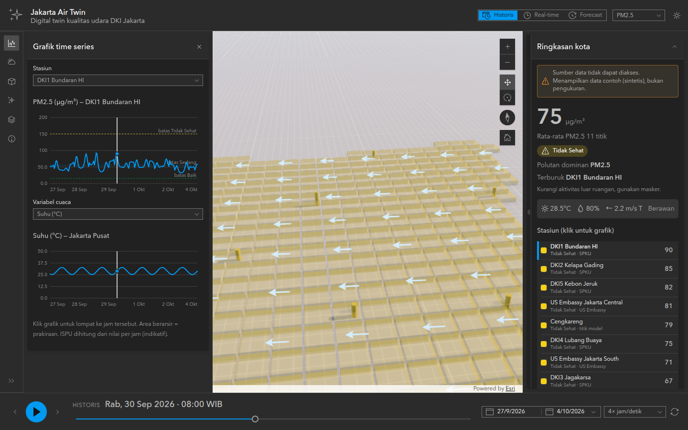
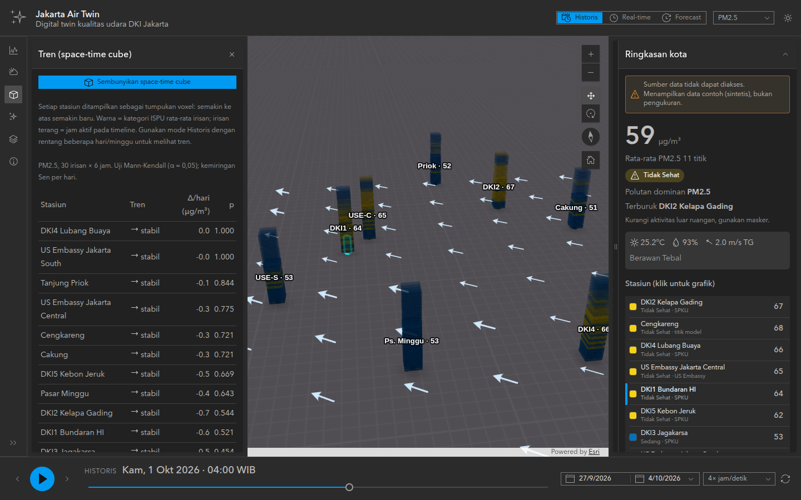
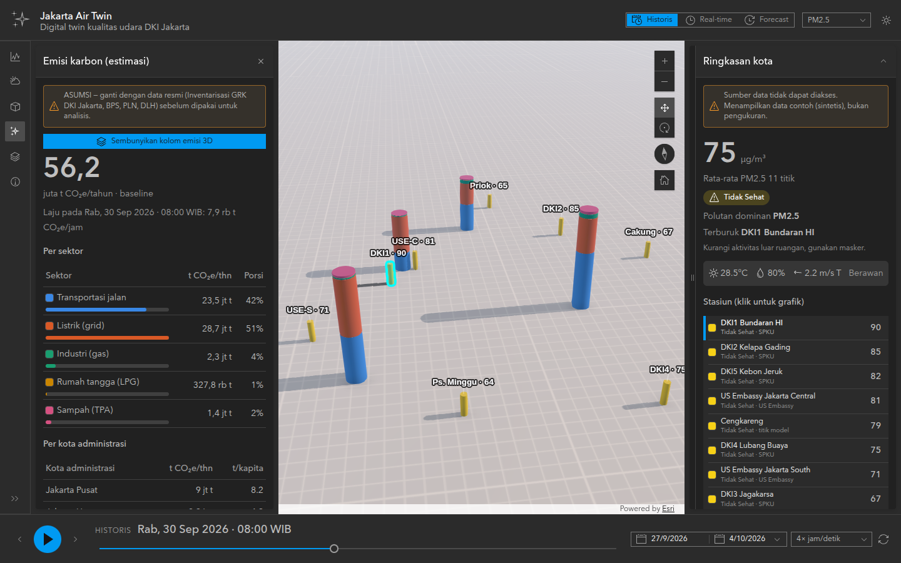
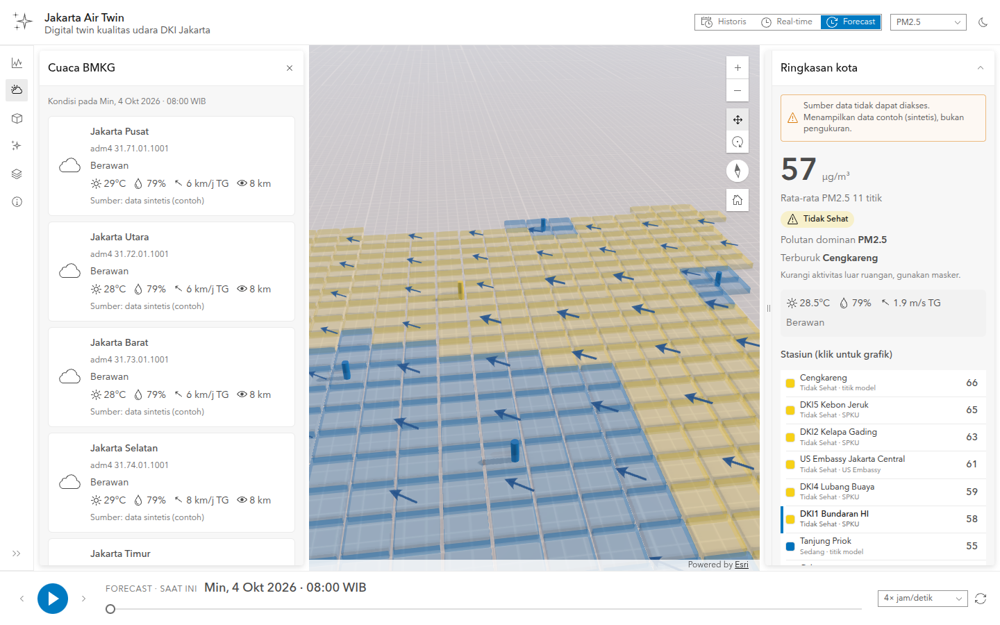
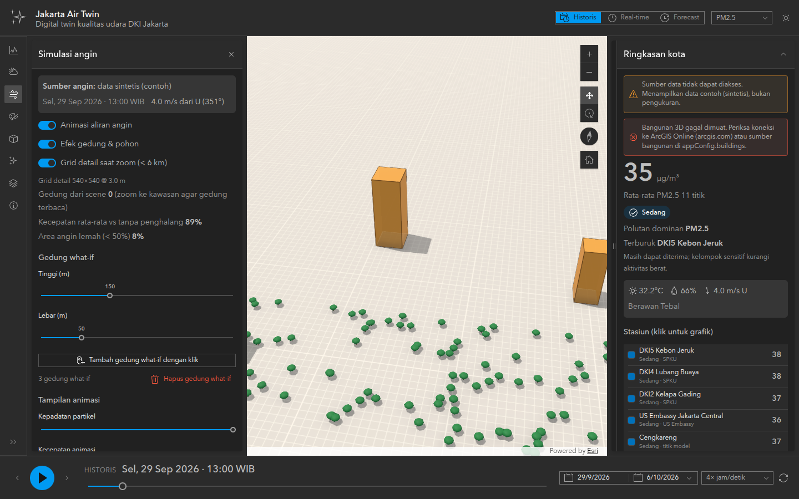
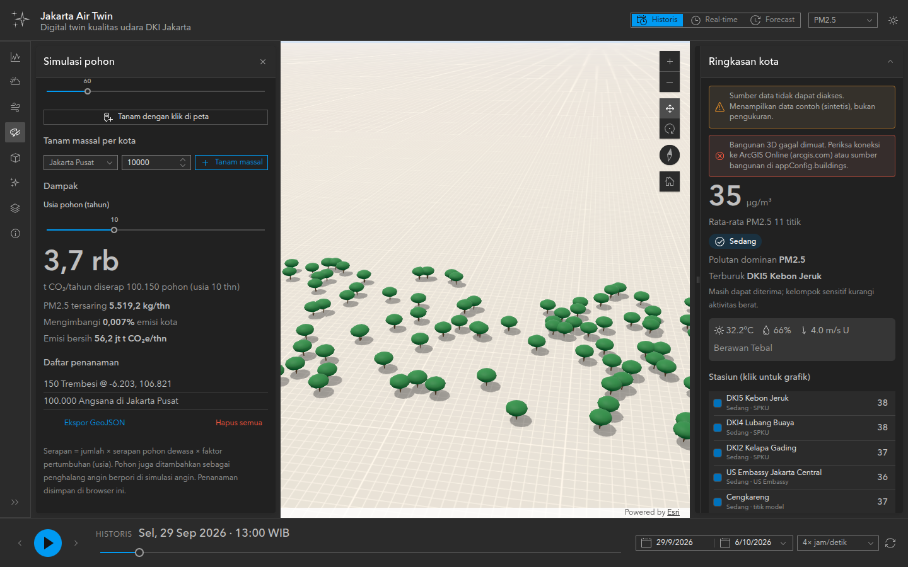

# Jakarta Air Twin — Digital Twin Kualitas Udara DKI Jakarta

Aplikasi web **digital twin** yang menampilkan polusi udara, cuaca, dan estimasi emisi karbon DKI Jakarta dalam 3D, dibangun dengan **[ArcGIS Maps SDK for JavaScript 5.1](https://developers.arcgis.com/javascript/latest/)** dan **[Calcite Design System](https://developers.arcgis.com/calcite-design-system/)**. Konsepnya terinspirasi dari [construction-timelapse](https://github.com/dchantlos/construction-timelapse): satu timeline yang memutar kota dari waktu ke waktu.



> Screenshot di atas diambil di lingkungan tanpa internet, sehingga basemap dan bangunan 3D tidak tampil dan data yang dipakai adalah fallback sintetis. Dengan koneksi internet, aplikasi memuat basemap, OSM 3D Buildings, serta data Open-Meteo dan BMKG.

## Fitur

| Fitur | Keterangan |
|---|---|
| **3 mode waktu** | **Historis** (rentang tanggal, maks. 31 hari), **Real-time** (48 jam terakhir, auto-refresh 15 menit, tombol *Live*), **Forecast** (5 hari ke depan) |
| **Timelapse** | Play/pause, langkah per jam, kecepatan 1–16× jam/detik, slider; semua layer & widget mengikuti jam aktif |
| **Kolom stasiun 3D** | 11 titik pantau (SPKU DKI1–5, US Embassy, titik model); tinggi & warna sesuai kategori ISPU; klik untuk grafik |
| **Volume polusi** | Grid interpolasi IDW, diklip ke batas DKI, diekstrusi sesuai indeks |
| **Medan angin** | Panah 3D hasil interpolasi vektor u/v dari titik cuaca |
| **Atmosfer** | Posisi matahari mengikuti jam timeline; hujan/awan dari data cuaca; **kabut dari PM2.5** |
| **Space-time cube** | Tumpukan voxel per stasiun (sumbu vertikal = waktu), irisan aktif menyala saat playback |
| **Analisis tren** | Uji **Mann-Kendall** + **Sen's slope** per stasiun (naik / turun / stabil) |
| **Emisi karbon** | Estimasi CO₂e *bottom-up* per sektor & kota administrasi, laju per jam, kolom 3D bertumpuk, **simulasi skenario** (EV, pengurangan km, energi terbarukan, sampah) |
| **Cuaca BMKG** | Prakiraan per kota administrasi pada jam aktif (ikon & deskripsi BMKG) |
| **Grafik** | Time series polutan per stasiun + variabel cuaca (termasuk tinggi lapisan batas/PBL), garis ambang ISPU, area prakiraan, tooltip |
| **Simulasi angin** | Animasi partikel seperti windy.com (FlowRenderer ArcGIS) dari data angin **BMKG** (jam prakiraan) / Open-Meteo (historis). Angin **terhalang gedung**: nol di dalam gedung, zona wake di belakang gedung, dibelokkan di sekitar gedung. Gedung dibaca dari layer 3D yang tampil + **gedung what-if** yang ditaruh dengan klik |
| **Simulasi pohon** | Tanam pohon per klik atau massal per kota (7 spesies). Hitung serapan CO₂ & PM2.5 sesuai usia, **emisi bersih** di modul emisi; pohon menjadi penghalang angin berpori. Ekspor GeoJSON |
| **Basemap 3D** | Basemap 3D ArcGIS (bangunan, label, pohon 3D) dengan pemilih basemap; fallback otomatis ke 2D + OSM 3D Buildings |
| **Tema** | Gelap/terang (Calcite) |

| Space-time cube & tren | Emisi karbon | Forecast + cuaca BMKG |
|---|---|---|
|  |  |  |

## Menjalankan

```bash
npm install
npm run dev        # http://localhost:5173
npm run build      # hasil di dist/
npm run typecheck
```

Konfigurasi opsional lewat `.env` (lihat `.env.example`):

| Variabel | Fungsi |
|---|---|
| `VITE_ARCGIS_API_KEY` | API key ArcGIS (ArcGIS Location Platform) bila basemap 3D / item butuh autentikasi. Tanpa key, aplikasi otomatis beralih ke basemap 2D + bangunan cadangan |
| `VITE_BMKG_BASE_URL` | Base URL API BMKG. Default `/proxy/bmkg` (proxy Vite) saat dev, `https://api.bmkg.go.id` saat build |
| `VITE_USE_MOCK_DATA` | `true` = selalu pakai data sintetis (demo offline) |
| `VITE_UDARA_JAKARTA_URL` | Endpoint JSON data SPKU DLH DKI (udara.jakarta.go.id) atau proxy Anda |

## Sumber data

| Data | Sumber | Catatan |
|---|---|---|
| Polusi (PM2.5, PM10, NO₂, O₃, SO₂, CO) | [Open-Meteo Air Quality](https://open-meteo.com/en/docs/air-quality-api) (Copernicus CAMS) | Historis + forecast, tanpa API key. Resolusi CAMS global ~45 km, jadi variasi antar titik kecil |
| Polusi stasiun | [udara.jakarta.go.id](https://udara.jakarta.go.id) (DLH DKI) | Adapter `jsonRecordsProvider`, aktif bila `VITE_UDARA_JAKARTA_URL` diisi; nama field disesuaikan di `udaraJakarta.ts` |
| Prakiraan cuaca | [BMKG](https://data.bmkg.go.id/prakiraan-cuaca/) `api.bmkg.go.id/publik/prakiraan-cuaca?adm4=` | 3 hari, per 3 jam; batas 60 request/menit; **wajib mencantumkan BMKG sebagai sumber** |
| Cuaca historis | [Open-Meteo](https://open-meteo.com/) Forecast/Archive | API publik BMKG tidak menyediakan arsip |
| Bangunan 3D | Item ArcGIS [`c444b24b184c4523a5dc96248bfea4e1`](https://www.arcgis.com/home/item.html?id=c444b24b184c4523a5dc96248bfea4e1) + **basemap 3D ArcGIS** (`dark-gray-3d` / `gray-3d`) | Jenis item dideteksi otomatis: layer → layer bangunan, Web Scene/Web Map → basemap. Cadangan: Esri OSM 3D Buildings. Bisa diganti ke Jakarta Satu / GeoJSON Overture (`appConfig.buildings`) |
| Emisi | `public/data/emission-inventory.json` | **Angka asumsi**: ganti dengan data resmi (Inventarisasi GRK DKI, BPS, PLN) |

Jika semua sumber nyata gagal, aplikasi otomatis memakai **data sintetis** dan menampilkan peringatan. Data nyata dan sintetis tidak pernah dicampur.

**ISPU** dihitung dengan rumus Permen LHK P.14/2020, tetapi dari nilai **per jam**, sehingga bersifat *indikatif* (ISPU resmi memakai rata-rata 24 jam untuk PM dan 8 jam untuk CO).

## Arsitektur

```
src/
├── config/
│   ├── app.config.ts      # kamera, stasiun, titik cuaca (kode adm4 BMKG), sumber bangunan, URL
│   └── modules.ts         # REGISTRY: daftar provider, layer, widget yang aktif
├── core/
│   ├── types.ts           # model data bersama (dataset, provider, sampel cuaca)
│   ├── store.ts           # store observable generik
│   ├── dataService.ts     # memuat & menggabungkan data dari semua provider
│   ├── timeline.ts        # pemutar timelapse
│   ├── ispu.ts            # breakpoint & kategori ISPU
│   ├── selectors.ts       # pembacaan turunan (ringkasan kota, seri per stasiun)
│   ├── trend.ts           # Mann-Kendall, Sen's slope, binning waktu
│   └── geo.ts, time.ts, profiles.ts
├── providers/             # sumber data (airquality/, weather/)
├── layers/                # modul visual di scene 3D
├── widgets/               # panel Calcite
├── emissions/             # fitur emisi karbon (model, state, layer, widget), mandiri
├── wind/                  # simulasi angin: model medan angin (worker), penghalang, FlowRenderer, widget
├── greening/              # simulasi pohon: spesies, state, layer pohon 3D, widget
└── ui/                    # shell, dock timeline, grafik SVG
```

Alur: `DataService` memanggil semua **provider** sesuai mode & rentang waktu. Data digabung per jam: provider yang lebih awal di registry menang, provider berikutnya mengisi celah. Hasilnya masuk ke `Store`. **Layer** dan **widget** berlangganan ke key store yang mereka perlukan, jadi tidak ada modul yang saling memanggil secara langsung.

## Menambah modul

### Provider data baru

```ts
// src/providers/airquality/openAq.ts
import type { AirQualityProvider } from "../../core/types";

export const openAq: AirQualityProvider = {
  id: "openaq",
  label: "OpenAQ",
  attribution: "OpenAQ (CC BY 4.0)",
  async fetch({ locations, times, range, signal }) {
    // ambil data → kembalikan { [stationId]: { pm2_5: (number|null)[], ... } } sejajar dengan `times`
    return {};
  },
};
```

Lalu daftarkan di `src/config/modules.ts` (urutan = prioritas). Untuk API yang mengembalikan daftar record JSON, cukup pakai `createJsonRecordsProvider({...})` tanpa menulis parser.

### Layer baru

```ts
import GraphicsLayer from "@arcgis/core/layers/GraphicsLayer";
import type { LayerModule } from "../core/modules";

export function createMyLayer(): LayerModule {
  const layer = new GraphicsLayer({ title: "Layer saya" });
  return {
    id: "my-layer",
    title: "Layer saya",
    visibleByDefault: true,
    legend: [{ label: "Contoh", color: "#2a78d6" }],
    controls: [], // slider opsional, otomatis tampil di widget Layer
    init({ map, store }) {
      map.add(layer);
      store.on(["timeIndex", "airQuality"], (s) => {
        /* gambar ulang untuk jam aktif */
      }, true);
    },
    setVisible: (v) => (layer.visible = v),
  };
}
```

Layer otomatis muncul di widget **Layer & legenda** beserta toggle, legenda, dan kontrolnya.

### Widget baru

```ts
import type { WidgetModule } from "../core/modules";

export const myWidget: WidgetModule = {
  id: "my-widget",
  title: "Widget saya",
  icon: "analysis", // ikon Calcite
  placement: "start", // "start" = action bar kiri, "end" = panel kanan
  create({ store }) {
    const el = document.createElement("div");
    store.on(["timeIndex"], (s) => (el.textContent = `Index ${s.timeIndex}`), true);
    return el;
  },
};
```

### Fitur besar (contoh: emisi)

Fitur yang punya state sendiri dapat dibuat sebagai folder mandiri dengan `Store<StateKhusus>` sendiri (lihat `src/emissions/`), lalu hanya layer & widget-nya yang didaftarkan di registry.

## Simulasi angin



1. Angin 10 m di setiap titik cuaca (BMKG untuk jam prakiraan, Open-Meteo untuk jam historis) diubah menjadi komponen u/v lalu diinterpolasi (IDW) ke grid.
2. Grid: **kota** (sel 60 m) saat kamera jauh, **detail** (sel ~3–10 m, maks. 640×640) di sekitar kamera saat ketinggian kamera < 6 km.
3. Penghalang: footprint + tinggi gedung dari scene layer 3D yang tampil (`SceneLayerView.queryFeatures` → bounding box mesh), gedung what-if, dan tajuk pohon (berpori).
4. Model (bukan CFD): angin = 0 di dalam gedung; reduksi wake `1 / (1 + 2,5 · max(H/d))` dengan melihat ke arah datang angin sampai 600 m; komponen yang menabrak gedung dibelokkan; di dalam tajuk pohon angin melemah.
5. Hasilnya menjadi raster in-memory `vector-uv` untuk `ImageryTileLayer` + `FlowRenderer` (animasi di GPU). Perhitungan berjalan di Web Worker.

Grid detail membutuhkan gedung yang sudah dimuat oleh view, jadi zoom ke kawasan (mis. Sudirman–Thamrin) agar efek gedung terlihat.

## Simulasi pohon



Serapan = jumlah pohon × serapan pohon dewasa × faktor pertumbuhan `1 − e^(−3·usia/umur_dewasa)`. Nilai per spesies di `public/data/tree-species.json` adalah **asumsi** dan perlu diganti dengan data penelitian lokal. Penanaman disimpan di browser (localStorage) dan bisa diekspor ke GeoJSON.

## Modul emisi karbon

Estimasi = **data aktivitas × faktor emisi** (IPCC 2006):

- Transportasi: jumlah kendaraan × km/tahun ÷ km/liter × faktor emisi BBM (bensin 2,31; solar 2,68 kgCO₂/L)
- Listrik: konsumsi MWh × faktor emisi grid Jawa-Bali (default 0,87 tCO₂/MWh)
- Industri (gas alam), rumah tangga (LPG), sampah TPA

Kendaraan listrik di skenario **memindahkan** emisi ke sektor listrik sesuai faktor grid dan porsi energi terbarukan. Laju per jam memakai profil harian per sektor (lalu lintas, beban listrik, memasak). Semua angka ada di `public/data/emission-inventory.json`.

## Roadmap

Planning & progres: issue [#1 (epic)](https://github.com/geoholix/dt-airpolution/issues/1) dan sub-issue-nya. Backlog: integrasi OpenAQ/WAQI, data SPKU udara.jakarta.go.id, bangunan Jakarta Satu/Overture, backend proxy & arsip, forecast lanjutan, emisi gridded (Climate TRACE/EDGAR).

## Atribusi

Data cuaca: **BMKG**. Kualitas udara: **Copernicus Atmosphere Monitoring Service** via **Open-Meteo.com** (CC BY 4.0). Bangunan: © kontributor **OpenStreetMap**, Esri. Peta & 3D: **Esri ArcGIS Maps SDK for JavaScript**.
